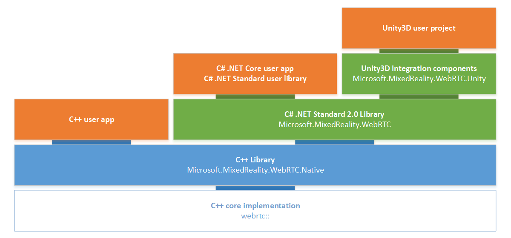

# MixedReality-WebRTC

[](https://github.com/microsoft/MixedReality-WebRTC/blob/master/LICENSE)

MixedReality-WebRTC is a library for peer-to-peer audio and video streaming based on the WebRTC protocol. The library provides an API for C++ and C# (.NET Standard 2.0), as well as some Unity3D helper components for quick setup.

MixedReality-WebRTC is part of the collection of repositories of the [Mixed Reality Sharing team](https://github.com/orgs/microsoft/teams/mixed-reality-sharing).

## Introduction 

MixedReality-WebRTC is a set of libraries building upon each other to deliver a consistent API to C++ and C# developers across its supported platforms, and a set of handful drop-in Unity3D for easy integration.

- **The C++ library** provides a low-level interface to the [underlying WebRTC implementation from Google](https://opensource.google.com/projects/webrtc). Compared to the API exposed by the Google implementation (`PeerConnection`), the current interface is simplified to remove the burden of setup and configuring. It is also targetted at providing a tight interaction with other Mixed Reality services.
- **The C# library** provides a .NET Standard 2.0 wrapper (C# 7.3) over the C++ library with familiar C# concepts like `async` and `Task`, hiding away from the developers the details of wrapping.
- **The Unity3D integration** builds over the C# library to provide drop-in `MonoBehaviour` components requiring almost no setup to get your Unity project going.



MixedReality-WebRTC is available for Windows Desktop and UWP (x86, x64, ARM32, ARM64), iOS and Android.

## Getting Started

MixedReality-WebRTC is currently under development, and precompiled packages are not yet available. See [Building MixedReality-WebRTC](Building-MixedReality-WebRTC) below for compiling the libraries from sources.

The current development branch is `dev`.

## Documentation

The API documentation is not available yet at that time.

## Features

The MixedReality-WebRTC supports features like:
- Video streaming from a remote device, including HoloLens [Mixed Reality Capture (MRC)](https://docs.microsoft.com/en-us/windows/mixed-reality/mixed-reality-capture).
- Peer-to-peer audio and video streaming for chat app scenario.
- Collaborative multi-party audio chat to support shared experiences.
- Networking back-end for [MixedReality-Sharing](https://github.com/microsoft/MixedReality-Sharing) to share an established WebRTC connection between audio/video streaming and state sharing synchronization.

## Building MixedReality-WebRTC

### Check out the MixedReality-WebRTC repository

```
git clone https://github.com/microsoft/MixedReality-WebRTC.git
```
 
### Check out the external dependencies

This may take some time due to the large number of submodules in the WebRTC UWP SDK repository.

```
cd external\webrtc-uwp-sdk
git submodule update --init --recursive
```

### Build the WebRTC UWP SDK libraries:

For Win32 (Desktop) support, open `external\webrtc-uwp-sdk\webrtc\windows\solution\WebRtc.Win32.sln` and build the x64 config in Debug or Release. The x64 modules are needed for the Unity editor.

For UWP support, open `external\webrtc-uwp-sdk\webrtc\windows\solution\WebRtc.Universal.sln` and build the relevant config. For HoloLens 2, build the Debug or Release ARM config.

### Build the MixedReality-WebRTC libraries

Open `Microsoft.MixedReality.WebRTC.sln` and build it.

On successful build, the relevant DLLs will be copied to `libs\Microsoft.MixedReality.WebRTC.Unity\Assets\Plugins\` for Unity to consume them.

The `Microsoft.MixedReality.WebRTC.sln` Visual Studio solution contains several projects:
- The native C++ library, which can be compiled for Desktop (`Microsoft.MixedReality.WebRTC.Native.Win32` project) or UWP (`Microsoft.MixedReality.WebRTC.Native.UWP` project).
- The C# library project `Microsoft.MixedReality.WebRTC`.
- A C# unit tests project `Microsoft.MixedReality.WebRTC.Tests`.
- A UWP C# sample app project `Microsoft.MixedReality.WebRTC.TestAppUWP` based on WPF and XAML.

### Optionally test the install

Test the install by _e.g._ opening the Unity project at `libs\Microsoft.MixedReality.WebRTC.Unity`, loading the `Assets\Examples\BasicPeerConnectionExample` scene and pressing Play. After a few seconds the left video track player should display the video feed from the local webcam. The Unity console should also display a message about the WebRTC library being initialized successfully.

## Contributing

This project welcomes contributions and suggestions.  Most contributions require you to agree to a
Contributor License Agreement (CLA) declaring that you have the right to, and actually do, grant us
the rights to use your contribution. For details, visit https://cla.microsoft.com.

When you submit a pull request, a CLA-bot will automatically determine whether you need to provide
a CLA and decorate the PR appropriately (e.g., label, comment). Simply follow the instructions
provided by the bot. You will only need to do this once across all repos using our CLA.

This project has adopted the [Microsoft Open Source Code of Conduct](https://opensource.microsoft.com/codeofconduct/).
For more information see the [Code of Conduct FAQ](https://opensource.microsoft.com/codeofconduct/faq/) or
contact [opencode@microsoft.com](mailto:opencode@microsoft.com) with any additional questions or comments.

## Reporting security issues and bugs

MixedReality-WebRTC builds upon the WebRTC implementation provided by Google. Security issues and bugs related to this implementation should be reported to Google.

Security issues and bugs related to MixedReality-WebRTC itself should be reported privately, via email, to the Microsoft Security Response Center (MSRC) secure@microsoft.com. You should receive a response within 24 hours. If for some reason you do not, please follow up via email to ensure we received your original message. Further information, including the MSRC PGP key, can be found in the [Security TechCenter](https://technet.microsoft.com/en-us/security/ff852094.aspx).
