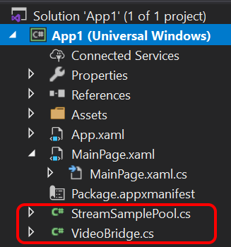
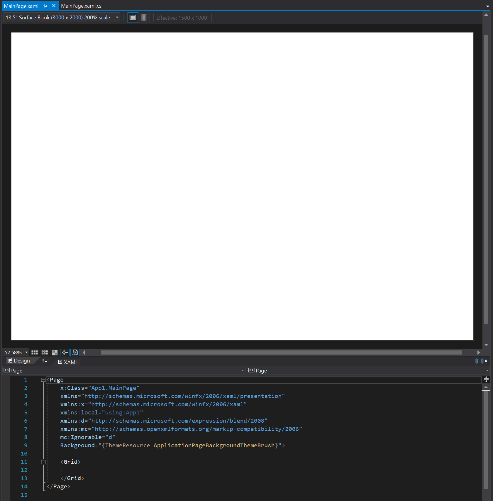

# Add local media tracks

Now that the peer connection is initialized, there are two possible paths, which can be both used:
- Immediately adding local audio and/or video tracks to the peer connection, so that they are available right away when the connection will be established with the remote peer.
- Waiting for the connection to be established, and add the local media tracks after that.

The first case is benefical in the sense that media tracks will be immediately negotiated during the connection establishing, without the need for an extra negotiation specific for the tracks. However it requires knowing in advance that the tracks are used. Conversely, the latter case corresponds to a scenario like late joining, where the user or the application can control when to add or remove local tracks, at the expense of requiring an extra network negotiation each time the list of tracks is changed.

In this tutorial, we add the local media tracks right away for simplicity.

## Adding the tracks

Continue editing the `MainPage.xaml.cs` file and append in the `OnLoaded` method the following:

1. Use the [`AddLocalVideoTrackAsync()`](xref:Microsoft.MixedReality.WebRTC.PeerConnection.AddLocalVideoTrackAsync(Microsoft.MixedReality.WebRTC.PeerConnection.LocalVideoTrackSettings)) method to add to the peer connection a local video track sending to the remote peer some video frames obtained from a local video capture device (webcam).
   ```cs
   await _peerConnection.AddLocalVideoTrackAsync();
   ```
   This method optionally takes a [`LocalVideoTrackSettings`](xref:Microsoft.MixedReality.WebRTC.PeerConnection.LocalVideoTrackSettings) object to configure the video capture. In this tutorial, we leave that object out and use the default settings, which will open the first available webcam with its default resolution and framerate. This is generally acceptable, although on mobile devices like HoloLens you probably want to limit the resolution and framerate to reduce the power consumption and save on battery.

2. Use the [`AddLocalAudioTrackAsync()`](xref:Microsoft.MixedReality.WebRTC.PeerConnection.AddLocalAudioTrackAsync) method to add to the peer connection a local audio track sending to the remote peer some audio frames obtained from a local audio capture device (microphone).
   ```cs
   await _peerConnection.AddLocalAudioTrackAsync();
   ```
   Unlike for the video track, the audio track currently does not offer any configuration option, and will always use the first available audio capture device.

At this point, if you run the application again, there is no visible difference, except some extra delay to open the audio and video devices; this delay varies greatly depending on the number of capture devices on the host machine, but is generally within a few seconds too, sometimes much less. Additionally, if the webcam or microphone have a LED indicating recording, it should turn ON when the capture device starts recording. But the captured audio and video are not visible. This is because the audio and video tracks are capturing frames from the webcam and microphone, to be sent later to the remote peer once connected to it, but there is no local rendering by default.

## Importing the `VideoBridge` utility

In order to display the local webcam feed as a feedback for the user, we need to collect the video frames captured by WebRTC via the webcam, and display them locally in the app using whichever technology we choose. In this tutorial for simplicity we use the [MediaPlayerElement](xref:Windows.UI.Xaml.Controls.MediaPlayerElement) XAML control, which is based on the Media Foundation framework. And to keep things simple, we also use [the `TestAppUwp.Video.VideoBridge` helper class](https://github.com/microsoft/MixedReality-WebRTC/blob/master/examples/TestAppUwp/Video/VideoBridge.cs) from the `TestAppUWP` sample application provided by MixedReality-WebRTC, which bridges a raw source of frames (WebRTC) with the [MediaPlayerElement](xref:Windows.UI.Xaml.Controls.MediaPlayerElement), taking care of the interoperability details for us.

The [`TestAppUwp.Video.VideoBridge`](https://github.com/microsoft/MixedReality-WebRTC/blob/master/examples/TestAppUwp/Video/VideoBridge.cs) helper class makes use of the [`StreamSamplePool`](https://github.com/microsoft/MixedReality-WebRTC/blob/master/examples/TestAppUwp/Video/StreamSamplePool.cs) class, which also needs to be imported. For the sake of simplicity in this tutorial we simply copy those two files.

1. Download the [`VideoBridge.cs`](https://github.com/microsoft/MixedReality-WebRTC/blob/master/examples/TestAppUwp/Video/VideoBridge.cs) and [`StreamSamplePool.cs`](https://github.com/microsoft/MixedReality-WebRTC/blob/master/examples/TestAppUwp/Video/StreamSamplePool.cs) from the MixedReality-WebRTC repository, or copy them from a local clone of the repository, and paste them into the current tutorial project.

2. Add a reference to the `App1.csproj` project by right-clicking on the project in the _Solution Explorer_ panel and selecting **Add** > **Existing Item...** (or using Shift+Alt+A), pointing the add dialog to the two newly copied files `VideoBridge.cs` and `StreamSamplePool.cs`.



## Editing the local video UI

Double-click on the `MainPage.xaml` (or right-click > **Open**) to bring up the XAML visual editor of the `MainPage` page. The page is currently blank, similar to what is displayed when launching the application. We will add a video player to it.



The XAML visual editor allows editing the XAML user interface both via the visual top panel and via the XAML code in the bottom panel. Which approach is best is generally up to personal preference, although for discoverability it is easier to drag and drop controls from the **Toolbox** panel. In this tutorial however we make use of the [MediaPlayerElement](xref:Windows.UI.Xaml.Controls.MediaPlayerElement) control which is not available from the toolbox.

Edit the `MainPage.xaml` code from the **XAML** panel of the editor, and inside the `<Grid>` element add a `<MediaPlayerElement>` node:
```xml
<Grid>
  <MediaPlayerElement x:Name="localVideoPlayerElement" />
</Grid>
```

This will create a media player which covers the entire surface of the application window.

## Bridging the track and its rendering

The key link between a raw source of video frames and the Media Foundation pipeline is the [`MediaStreamSource`](xref:Windows.Media.Core.MediaStreamSource) class, which wraps an external video source to deliver raw frames directly to the media playback pipeline.

Get back to the associated `MainPage.xaml.cs` and continue editing:

1. At the top of the file, import the following extra modules:
   ```cs
   using TestAppUWP.Video;
   using Windows.Media.Core;
   using Windows.Media.Playback;
   using Windows.Media.MediaProperties;
   ```

2. Create a new utility method `CreateI420VideoStreamSource()` which builds a [`MediaStreamSource`](xref:Windows.Media.Core.MediaStreamSource) instance to encaspulate a given video stream encoded in I420 format, which is the encoding in which WebRTC provides its raw video frames. This method will be reused later for the remote video too.
   ```cs
   private MediaStreamSource CreateI420VideoStreamSource(
       uint width, uint height, int framerate)
   {
       if (width == 0)
       {
           throw new ArgumentException("Invalid zero width for video.", "width");
       }
       if (height == 0)
       {
           throw new ArgumentException("Invalid zero height for video.", "height");
       }
       // Note: IYUV and I420 have same memory layout (though different FOURCC)
       // https://docs.microsoft.com/en-us/windows/desktop/medfound/video-subtype-guids
       var videoProperties = VideoEncodingProperties.CreateUncompressed(
           MediaEncodingSubtypes.Iyuv, width, height);
       var videoStreamDesc = new VideoStreamDescriptor(videoProperties);
       videoStreamDesc.EncodingProperties.FrameRate.Numerator = (uint)framerate;
       videoStreamDesc.EncodingProperties.FrameRate.Denominator = 1;
       // Bitrate in bits per second : framerate * frame pixel size * I420=12bpp
       videoStreamDesc.EncodingProperties.Bitrate = ((uint)framerate * width * height * 12);
       var videoStreamSource = new MediaStreamSource(videoStreamDesc);
       videoStreamSource.BufferTime = TimeSpan.Zero;
       videoStreamSource.SampleRequested += OnMediaStreamSourceRequested;
       videoStreamSource.IsLive = true; // Enables optimizations for live sources
       videoStreamSource.CanSeek = false; // Cannot seek live WebRTC video stream
       return videoStreamSource;
   }
   ```

The `CreateI420VideoStreamSource()` method references the [`SampleRequested`](xref:Windows.Media.Core.MediaStreamSource.SampleRequested) event, which is invoked by the Media Foundation playback pipeline when it needs a new frame. We use the `VideoBridge` helper class to serve those frames.

1. At the top of the `MainPage` class, define two new variables: a [`MediaStreamSource`](xref:Windows.Media.Core.MediaStreamSource) for wrapping the local video stream and exposing it to the Media Foundation playback pipeline, and a [`VideoBridge`](https://github.com/microsoft/MixedReality-WebRTC/blob/master/examples/TestAppUwp/Video/VideoBridge.cs) for managing the delivery of the video frames. The video bridge is initialized with a queue capacity of 3 frames, which is generally enough for local video as it is not affected by network latency.
   ```cs
   private MediaStreamSource _localVideoSource;
   private VideoBridge _localVideoBridge = new VideoBridge(3);
   ```

2. Implement the `OnMediaStreamSourceRequested()` callback using the video bridge. As we plan to reuse that callback for the remote video, the code finds the suitable video bridge based on the source which invoked the event.
   ```cs
   private void OnMediaStreamSourceRequested(MediaStreamSource sender,
       MediaStreamSourceSampleRequestedEventArgs args)
   {
       VideoBridge videoBridge;
       if (sender == _localVideoSource)
           videoBridge = _localVideoBridge;
       else
           return;
       videoBridge.TryServeVideoFrame(args);
   }
   ```

3. In the `OnLoaded()` method where the peer connection was initialized, subscribe to the [`I420LocalVideoFrameReady`](xref:Microsoft.MixedReality.WebRTC.PeerConnection.I420LocalVideoFrameReady) event just after the call to [`InitializeAsync()`](xref:Microsoft.MixedReality.WebRTC.PeerConnection.InitializeAsync(Microsoft.MixedReality.WebRTC.PeerConnectionConfiguration,CancellationToken)) returned.
   ```cs
   await _peerConnection.InitializeAsync(config);
   _peerConnection.I420LocalVideoFrameReady += Peer_LocalI420FrameReady;
   Debugger.Log(0, "", "Peer connection initialized successfully.\n");
   ```

4. Implement the event handler by enqueueing the newly captured video frames into the bridge, which will later deliver them when the Media Foundation playback pipeline requests them.
   ```cs
   private void Peer_LocalI420FrameReady(I420AVideoFrame frame)
   {
       _localVideoBridge.HandleIncomingVideoFrame(frame);
   }
   ```

## Starting the media playback

The last part is to actually start the playback pipeline when video frames start to be received from WebRTC. This is done lazily for two reasons:
- to avoid starving the Media Foundation playback pipeline if the WebRTC local video track takes some time to start delivering frames, which it generally does compared to the expectation of the playback pipeline.
- to get access to the frame resolution, which is not otherwise available from WebRTC.

Unfortunately at this time the capture framerate is not available, so we assume a framerate of 30 frames per second (FPS).

1. At the top of the `MainPage` class, add a boolean field to indicate whether the local video is playing. This is protected by a lock, because the [`I420LocalVideoFrameReady`](xref:Microsoft.MixedReality.WebRTC.PeerConnection.I420LocalVideoFrameReady) and the [`SampleRequested`](xref:Windows.Media.Core.MediaStreamSource.SampleRequested) events can be fired in parallel from multiple threads.
   ```cs
   private bool _localVideoPlaying = false;
   private object _localVideoLock = new object();
   ```

2. Modify the `Peer_LocalI420FrameReady()` event handler to start the media player when the first WebRTC frame arrives.
   ```cs
   private void Peer_LocalI420FrameReady(I420AVideoFrame frame)
   {
       lock (_localVideoLock)
       {
           if (!_localVideoPlaying)
           {
               _localVideoPlaying = true;

               // Capture the resolution into local variable useable from the lambda below
               uint width = frame.width;
               uint height = frame.height;

               // Defer UI-related work to the main UI thread
               RunOnMainThread(() =>
               {
                   // Bridge the local video track with the local media player UI
                   int framerate = 30; // for lack of an actual value
                   _localVideoSource = CreateI420VideoStreamSource(
                       width, height, framerate);
                   var localVideoPlayer = new MediaPlayer();
                   localVideoPlayer.Source = MediaSource.CreateFromMediaStreamSource(
                       _localVideoSource);
                   localVideoPlayerElement.SetMediaPlayer(localVideoPlayer);
                   localVideoPlayer.Play();
               });
           }
       }
       _localVideoBridge.HandleIncomingVideoFrame(frame);
   }
   ```
   Some of the work cannot be carried during the execution of this event handler, which is invoked from an unspecified worker thread, because access to XAML UI elements must be done exclusively on the main UI thread. Therefore we use a helper method which schedule this work for execution on that thread.

   > [!NOTE]
   > The use of `_localVideoSource` from the `OnMediaStreamSourceRequested()` event handler is not protected by the `_localVideoLock` lock. This is because the event cannot be fired until well after the `_localVideoSource` has been assigned a new value, so there is no race condition concern here. And since `_localVideoSource` is not further modified, we avoid acquiring that lock in the `OnMediaStreamSourceRequested()` to reduce the chances of contention. The lock is actually not needed at all at this point, since `_localVideoPlaying` is also only modified in the current `Peer_LocalI420FrameReady()` event handler. But a typical application will provide some UI like a button to start and stop the local video, and therefore needs to synchronize access to `_localVideoPlaying` and `_localVideoSource`, at which point `OnMediaStreamSourceRequested()` will also need to acquire this lock.

3. Implement the `RunOnMainThread()` helper using the [`Dispatcher`](xref:Windows.UI.Core.CoreWindow.Dispatcher) of the current window.
   ```cs
   private void RunOnMainThread(Windows.UI.Core.DispatchedHandler handler)
   {
       if (Dispatcher.HasThreadAccess)
       {
           handler.Invoke();
       }
       else
       {
           // Note: use a discard "_" to silence CS4014 warning
           _ = Dispatcher.RunAsync(Windows.UI.Core.CoreDispatcherPriority.Normal, handler);
       }
   }
   ```

At this point the [MediaPlayerElement](xref:Windows.UI.Xaml.Controls.MediaPlayerElement) control and the WebRTC local video track are connected together. Launch the application again; the local webcam starts capturing video frame, which are displayed in the main window of the application.

----

Next : [A custom signaling solution](helloworld-cs-signaling-uwp.md)
