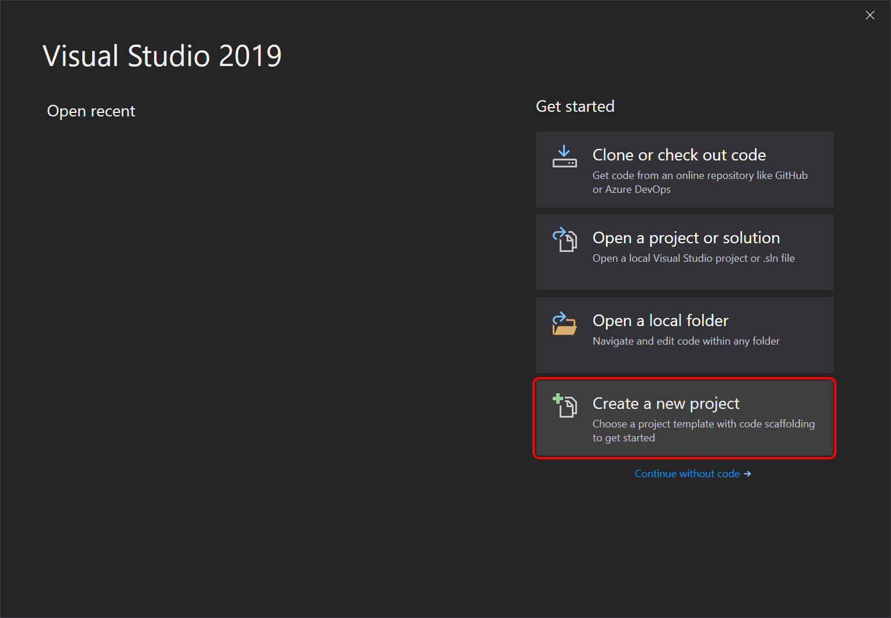
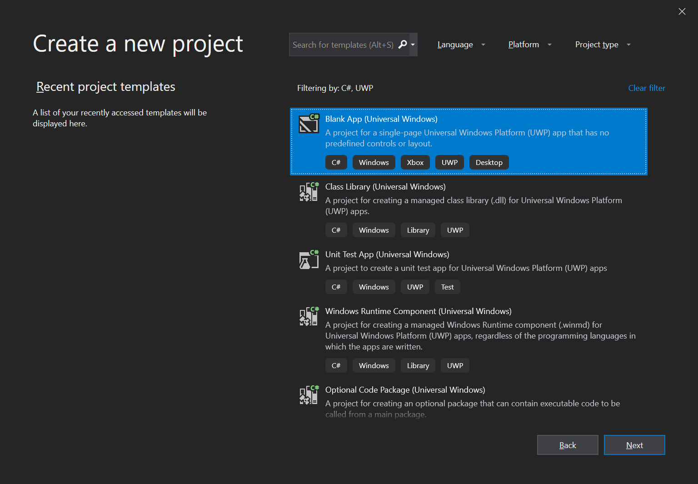
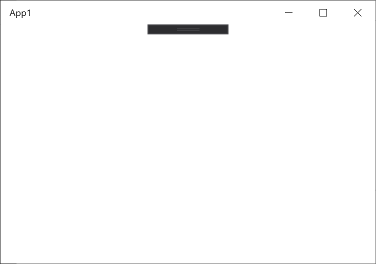
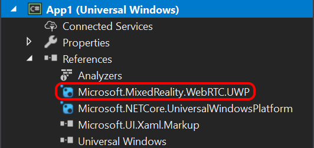
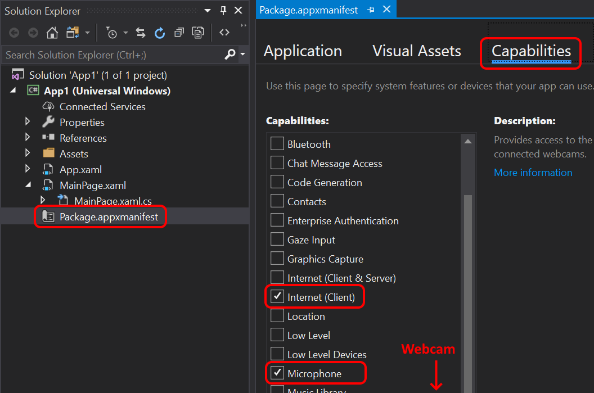
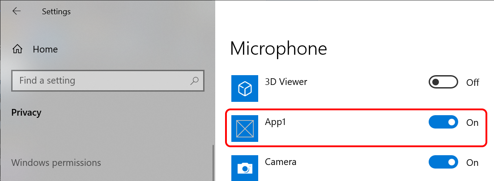

# Creating a project

In this tutorial we create a C# UWP application with a simple XAML-based UI to render video.

_Note_: At this time there is no solution to render raw video frames from a .NET Core 3.0 application that is simple and short enough to be used in a turorial. Instead, we use the `MediaPlayerElement` XAML control from UWP which provides the necessary API. Its WPF equivalent `MediaElement` unfortunately does not currently allow specifying a custom video source other than an URI-based source like a file on disk.

_Note_: This tutorial assumes that the host device where the app will be running during the tutorial has access to:
- a webcam, or any other video capture device recognized by WebRTC
- a microphone, or any other audio capture device recognized by WebRTC

## Generate the project

Open Visual Studio 2019 and select **Create a new project**.



Filter projects by **Language** = **C#** and **Platform** = **UWP** to find the **Blank App (Universal Window)** project template.



When prompted to select a platform version, chose a version of at least **Windows 10, version 1803 (10.0; Build 17134)** or higher, as older versions are not officially supported by MixedReality-WebRTC. For HoloLens 2 development, it is strongly recommended to select at least **Windows 10, version 1903 (10.0; Build 18362)** to be able to use the latest OS APIs, although those are not used in this tutorial.

Visual Studio 2019 generates a C# project (`.csproj`) and solution (`.sln`). In this tutorial we use the default name `App1`, therefore we get the following hierarchy:

```
- App1/
  - Assets/
  - App.xaml
  - App.xaml.cs
  - App1.csproj
  - MainPage.xaml
  - MainPage.xaml.cs
- App1.sln
```

At this point the project is already in a working state, although not yet functional. Press **F5** or select in the menu **Debug** > **Start Debugging** to build and launch the application. A blank window titles "App1" should appear.



_Note_: At the top of the window, the XAML debug bar allows access to debugging feature for the UI. This bar only appears while debugging, not when running the app outside Visual Studio 2019. It can be ignored.

## Add a dependency to MixedReality-WebRTC

In order to use the MixedReality-WebRTC project in this new `App1` application, we will add a dependency to its C# NuGet package hosted on [nuget.org](https://www.nuget.org/). This is by far the easiest way, although a locally-built copy of the `Microsoft.MixedReality.WebRTC.dll` assembly could also be alternatively used (but this is out of the scope of this tutorial).

In the **Solution Explorer**, right-click on the **App1 (Universal Windows)** C# project and select the **Manage NuGet Packages...** menu entry. This opens a new tab **NuGet: App1** which allows configuring the NuGet dependencies for this project alone. The **Installed** tab contains the list of NuGet dependencies already installed, and should contain the **Microsoft.NETCore.UniversalWindowsPlatform** which was already installed by Visual Studio when creating the project.


Select the **Browse** tab and, after making sure that the **Package source** is set to **nuget.org**, select the **Microsoft.MixedReality.WebRTC.UWP** NuGet package and click **Install**.


_Note_: If you cannot find the package, make sure that **Include prerelease** is checked, which disables filtering out preview packages (those packages with a version containing a suffix like "-preview" after the X.Y.Z version number).

This will download from [nuget.org](https://www.nuget.org/) and install the `Microsoft.MixedReality.WebRTC.UWP.nupkg` NuGet package, which contains the `Microsoft.MixedReality.WebRTC.dll` assembly, as well as its native dependencies (x86, x64, ARM) for the UWP platform.

After that, the `App1` project should contain a reference to the package.




## Test the reference

In order to ensure everything works fine and the `Microsoft.MixedReality.WebRTC` assembly can be used, we will use one of its functions to list the video capture devices, as a test. This makes uses of the static method [`PeerConnection.GetVideoCaptureDevicesAsync()`](cref:Microsoft.MixedReality.WebRTC.PeerConnection.GetVideoCaptureDevicesAsync). This is more simple than creating objects, as there is no clean-up needed after use.

First, because this sample application is a UWP application, it needs to declare some capabilities to access the microphone and webcam on the host device. In the **Solution Explorer** of Visual Studio, double-click on the `Package.appxmanifest` to open the AppX manifest of the app and select the **Capabilities** tab. Check **Microphone** and **Webcam**, and confirm that **Internet (Client)** is already checked.



Next, edit `MainPage.xaml.cs`:

1. At the top of the file, add some `using` statement to import the `Microsoft.MixedReality.WebRTC` assembly. Also import the `System.Diagnostics` module, as we will be using the `Debugger` class to print debug information to the Visual Studio output window. Finally, import the `Windows.Media.Capture` module to be able to request access to the microphone and webcam.
   ```cs
   using Microsoft.MixedReality.WebRTC;
   using System.Diagnostics;
   using Windows.Media.Capture;
   ```

2. In the `MainPage` constructor, register a handler for the `OnLoaded` event, which will be fired once the XAML user interface finished loading. For now it is not required to wait on the UI to call `Microsoft.MixedReality.WebRTC` methods. But later when accessing the UI to interact with its controls, either to get user inputs or display results, this will be required. So as a best practice we start doing so right away instead of invoking some code directly in the `MainPage` constructor.
   ```cs
   public MainPage()
   {
       this.InitializeComponent();
       this.Loaded += OnLoaded;
   }
   ```

3. Create the event handler `OnLoaded()` and use it to request access from the user to the microphone and camera, and enumerate the video capture devices. The `MediaCapture.InitializeAsync()` call will prompt the user with a dialog to authorize access to the microphone and webcam. The latter be must authorized before calling `PeerConnection.GetVideoCaptureDevicesAsync()`, while the former will be needed in the following of the tutorial for calls like `PeerConnection.AddLocalAudioTrackAsync()`.
   ```cs
   private async void OnLoaded(object sender, RoutedEventArgs e)
   {
       // Request access to microphone and camera
       var settings = new MediaCaptureInitializationSettings();
       settings.StreamingCaptureMode = StreamingCaptureMode.AudioAndVideo;
       var capture = new MediaCapture();
       await capture.InitializeAsync(settings);

       // Retrieve a list of available video capture devices (webcams).
       List<VideoCaptureDevice> deviceList = await PeerConnection.GetVideoCaptureDevicesAsync(); 

       // Get the device list and, for example, print them to the debugger console
       foreach (var device in deviceList)
       {
           // This message will show up in the Output window of Visual Studio
           Debugger.Log(0, "", $"Webcam {device.name} (id: {device.id})\n");
       }
   }
   ```

Launch the app again. The main window is still empty, but the **Output window** of Visual Studio 2019 (**View** > **Output**, or **Alt + 2**) should show a list of devices. This list depends on the actual host device running the app, but looks something like:
```
Webcam <some device name> (id: <some device ID>)
```

Note that there might be multiple lines if multiple capture devices are available. In general the first one listed will be the default used by WebRTC, although it is possible to explicitly select a device (see [`PeerConnection.AddLocalVideoTrackAsync`](cref:Microsoft.MixedReality.WebRTC.PeerConnection.AddLocalVideoTrackAsync(Microsoft.MixedReality.WebRTC.PeerConnection.LocalVideoTrackSettings))).

If this is the first time that `MediaCapture.InitializeAsync()` is requesting access to the webcam and microhpone, Windows displays a prompt asking the user for confirmation. You must click **Yes**, otherwise access to the microphone and webcam will be denied, and WebRTC will not be able to use them. This is part of the standard UWP capability mechanism for security and privacy.


If you clicked **No** by mistake, the prompt will not appear again and access will be silently denied on next runs. To change this access setting again, go to the Windows **Settings** > **Privacy** > **Microphone**, find the `App1` application and toggle its access **On**. Do the same for the webcam from the **Settings** > **Privacy** > **Camera** page.



----

Next : [Creating a peer connection](helloworld-cs-peerconnection-uwp.md)
